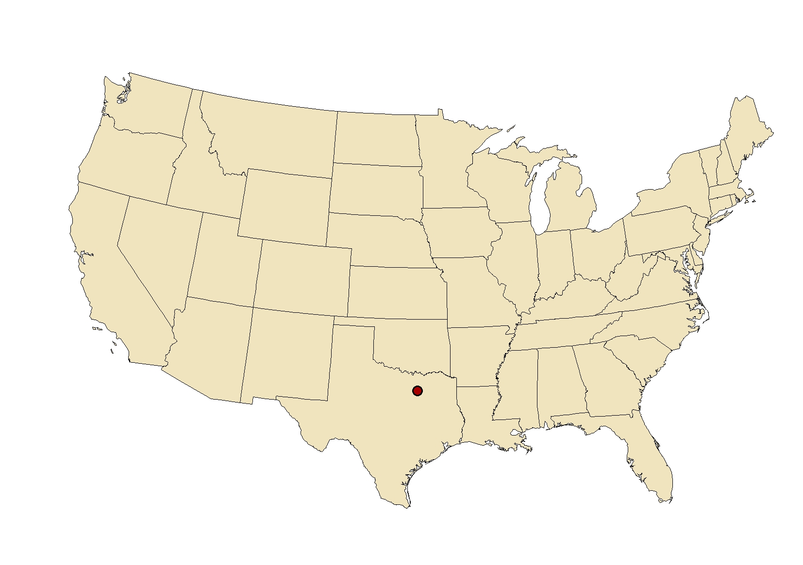

# 1. 达拉斯概况

****

**在美国，德州的面积仅次于阿拉斯加，人口和经济仅次于加州，全美第二。州内一共有53家财富500强企业总部，华人也很多，工作机会相对不少。**&#x20;

**达拉斯处于德州的北部，距奥斯丁约三个小时车程，，喜欢看NBA比赛的同学可以亲临现场。喜欢购物的同学推荐San Marcos Premium Outlets，是全美排名前几的大型outlet之一，从Dallas开车前往约4个小时。也可去Allen Premium Outlet，就在达拉斯附近。**

**Dallas气候较为干燥，四季都如此。夏季气温很高，可以达到40+摄氏度，八点半到九点太阳落山。室外暴晒，室内空调冷气很足，内外温差很大。冬季一般最低零度左右，极少下雪，极端情况下最冷可以达到零下十几摄氏度。**

**UTD校内安全系数很高，校外会有一些不安全的区段，同学们谨记，随身常备十几二十刀的“保命钱”。**

**Dallas有公交系统，学生可申请免费的Dart Pass，凭卡可以免费乘坐DART系统的bus和rail。**
