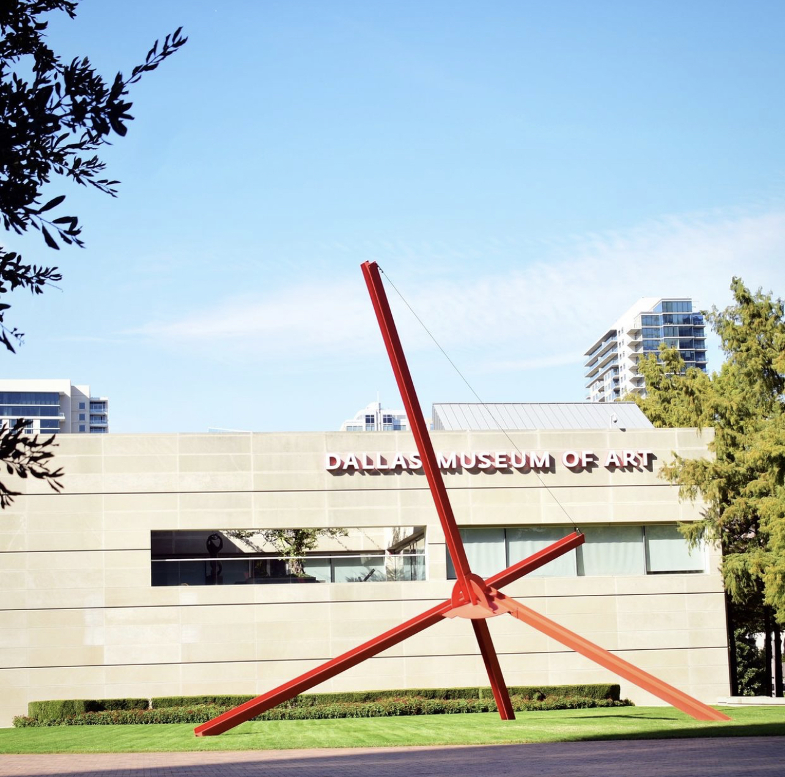
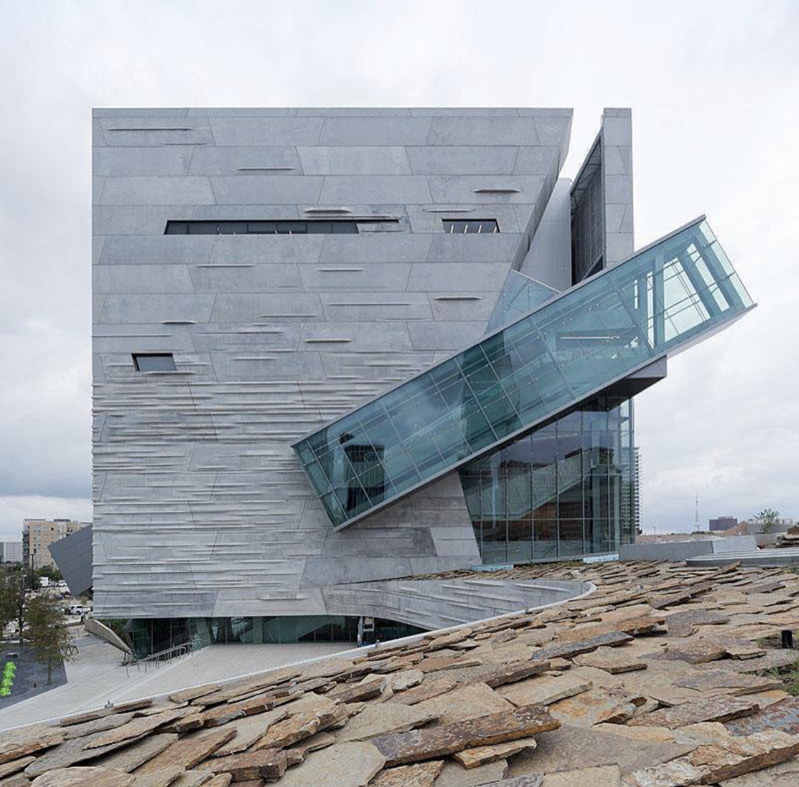
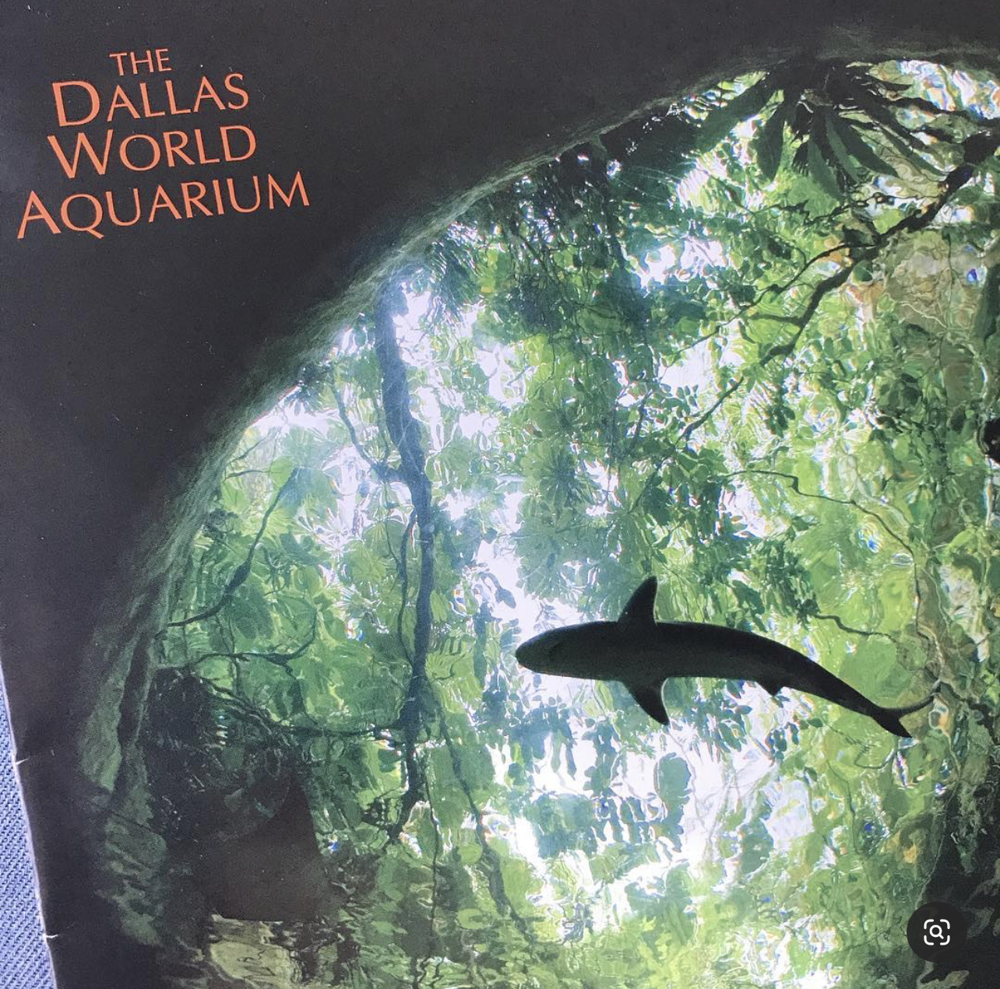
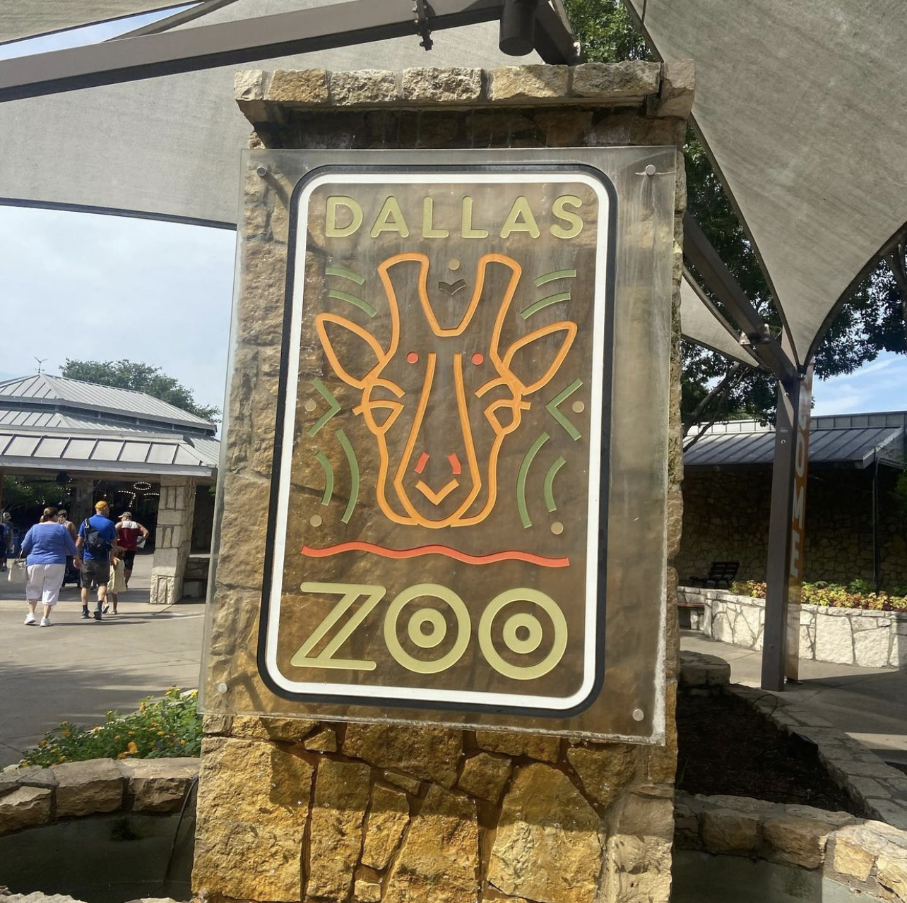
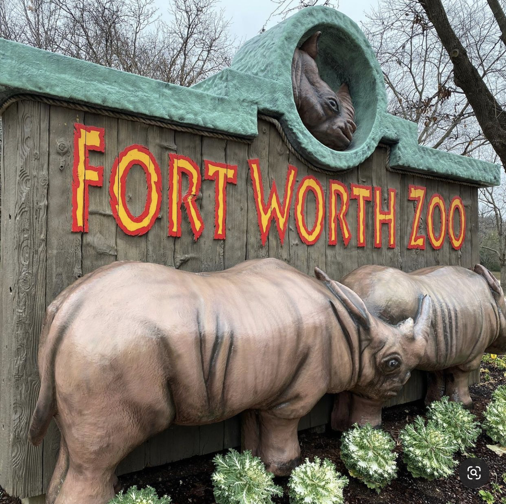

# 11. 游在达拉斯

## <mark style="color:blue;">1.</mark> <mark style="color:blue;"></mark><mark style="color:blue;">**游览场馆(博物馆、动物园及植物园)**</mark>

大部分场馆出示Comet Card会有折扣。强烈推荐以下展馆，博物馆的展现的视角和国内完全不同，会对世界有新的认识！

#### **Dallas Museum of Art 达拉斯艺术博物馆**

地址: 1717 N Harwood St, Dallas, TX 75201

营业时间：Closed Monday\
&#x20;                 Tuesday–Thursday: 11:00 a.m.–5:00 p.m.\
&#x20;                 Friday: 11:00 a.m.–9:00 p.m.\
&#x20;                 Saturday and Sunday: 11:00 a.m.–5:00 p.m.

网址：[**https://dma.org/**](https://dma.org)****

**Perot Museum of Nature and Science 达拉斯自然与科学博物馆**

地址: 2201 N Field St, Dallas, TX 75201

营业时间：Monday: 10 a.m. to 5 p.m.\
&#x20;                 Tuesday: CLOSED\
&#x20;                 Wednesday–Saturday: 10 a.m. to 5 p.m.\
&#x20;                 Sunday: 11 a.m. to 5 p.m.\
&#x20;                 Member-only access:\
&#x20;                 Saturday: 9 to 10 a.m., Sunday: 10 to 11 a.m.

网址：[https://www.perotmuseum.org/](https://www.perotmuseum.org)

**Dallas World Aquarium 达拉斯水族馆**

地址: 1801 N Griffin St, Dallas, TX 75202

营业时间：Monday - Friday 8:30 am – 5:00 pm, Last Entry: 3:30 pm\*\
&#x20;                 Saturday - Sunday 8:30 am - 5:30 pm, Last Entry: 4:00 pm\*

网址：[https://dwazoo.com/](https://dwazoo.com)

**The Sixth Floor Museum 肯尼迪纪念馆**

地址: 411 Elm St, Dallas, TX 75202

营业时间：Wednesday - Sunday 10AM - 5PM

网址：[https://www.jfk.org/](https://www.jfk.org)

**Dallas Zoo 达拉斯动物园**

地址：650 S R L Thornton Fwy, Dallas, TX 75203

营业时间：9:00 a.m. to 4:00 p.m. daily

网址：[https://www.dallaszoo.com/](https://www.dallaszoo.com)

**Fort Worth Zoo 沃斯堡动物园**

地址: 1989 Colonial Pkwy, Fort Worth, TX 76109

营业时间：10 a.m. to 4 p.m. (daily)

网址：[https://www.fortworthzoo.org/](https://www.fortworthzoo.org)

## <mark style="color:blue;">**2. 外出旅游**</mark>

#### **2.1 境内游(自驾/飞机)**

如果在美国境内旅行的话，不需要办理travel i-20，一般会采用自驾或者乘坐飞机的方式。自驾可以选择在大公司租车比如enterprise公司，根据政策办理保险等，也可以选择异地换车但费用较高。乘坐飞机的话最好提前安排出行计划，提前购买机票，有时候航空公司意想不到的折扣会给自己省不少钱。&#x20;

#### **2.2 境外游(travel i-20)**

&#x20;[www.utdallas.edu/isso/travel-outside-us](https://isso.utdallas.edu/travel-and-visas/travel/)

若要从美国出境，记得带 I-20 跟申请表去 ISSO 签名，不然回美国时会无法入境；通常签名的有效期为一年。美国除了许多知名的大城市，更有壮丽的自然景色，来到这里念书，若不把握机会四处走走非常可惜。可以好好利用连假，租车或是搭乘国内航班都十分方便，可参考以下网址寻找便宜的住宿交通。

#### 2.3 相关网站

**❖ 机票**

[https://www.google.com/flights](https://www.google.com/flights)&#x20;

[https://www.priceline.com](https://www.priceline.com)

[https://www.studentuniverse.com](https://www.studentuniverse.com)&#x20;

[https://www.expedia.com](https://www.expedia.com)

[https://www.booking.com ](https://www.booking.com)

[https://www.tripadvisor.com](https://www.tripadvisor.com)

[https://www.orbitz.com](https://www.orbitz.com)&#x20;

[https://www.edreams.com](https://www.edreams.com)

**❖ 住宿**

[https://www.agoda.com](https://www.agoda.com)&#x20;

[https://www.airbnb.com](https://www.airbnb.com)&#x20;

[https://www.hotels.com](https://www.hotels.com)

**❖ 租车**

[https://www.hertz.com](https://www.hertz.com)(有AAA 保险可享折扣优惠)&#x20;

[https://www. enterprise.com](https://www.enterprise.com)

[https://www.avis.com ](https://www.avis.com/en/home)

[https://www.budget.com ](https://www.budget.com/en/home)
