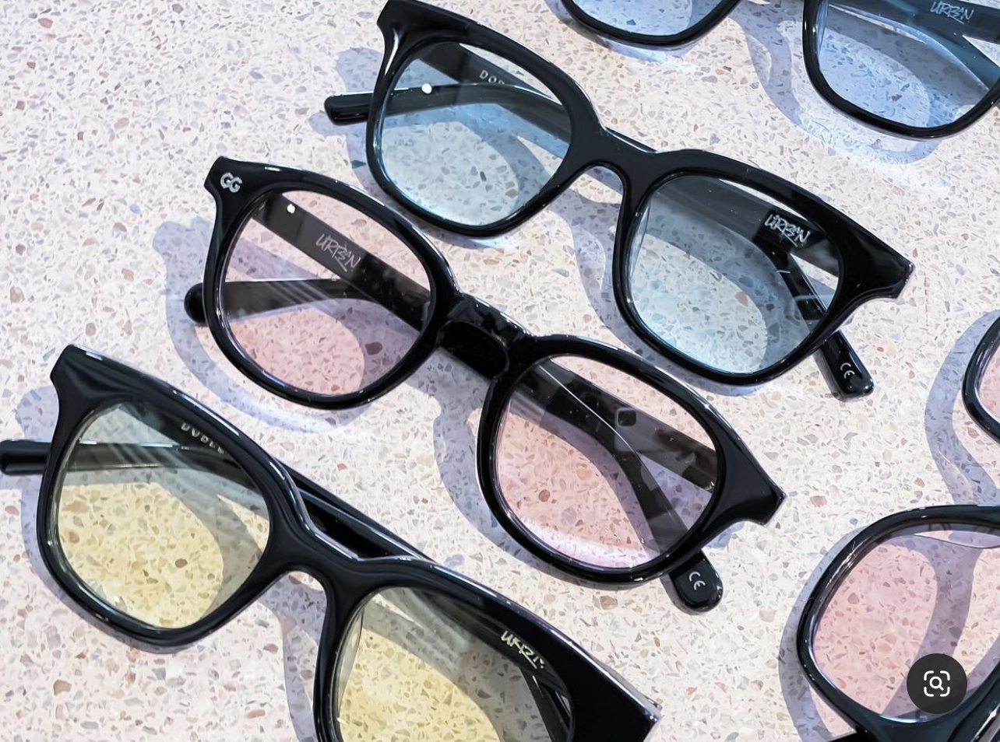
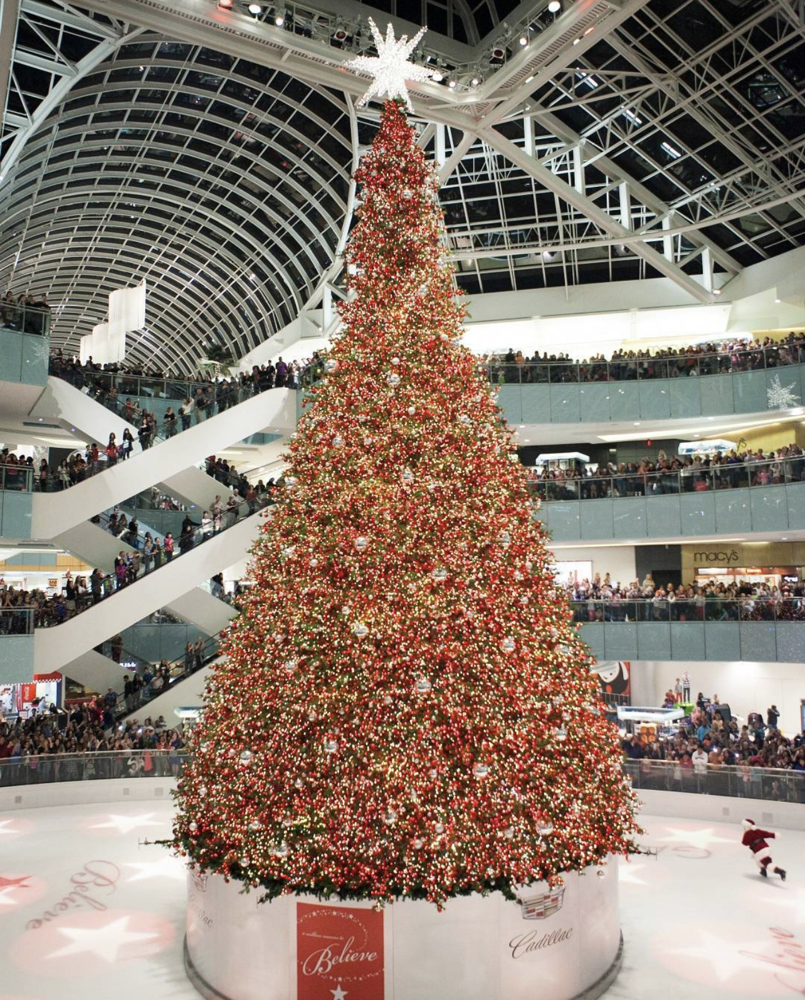
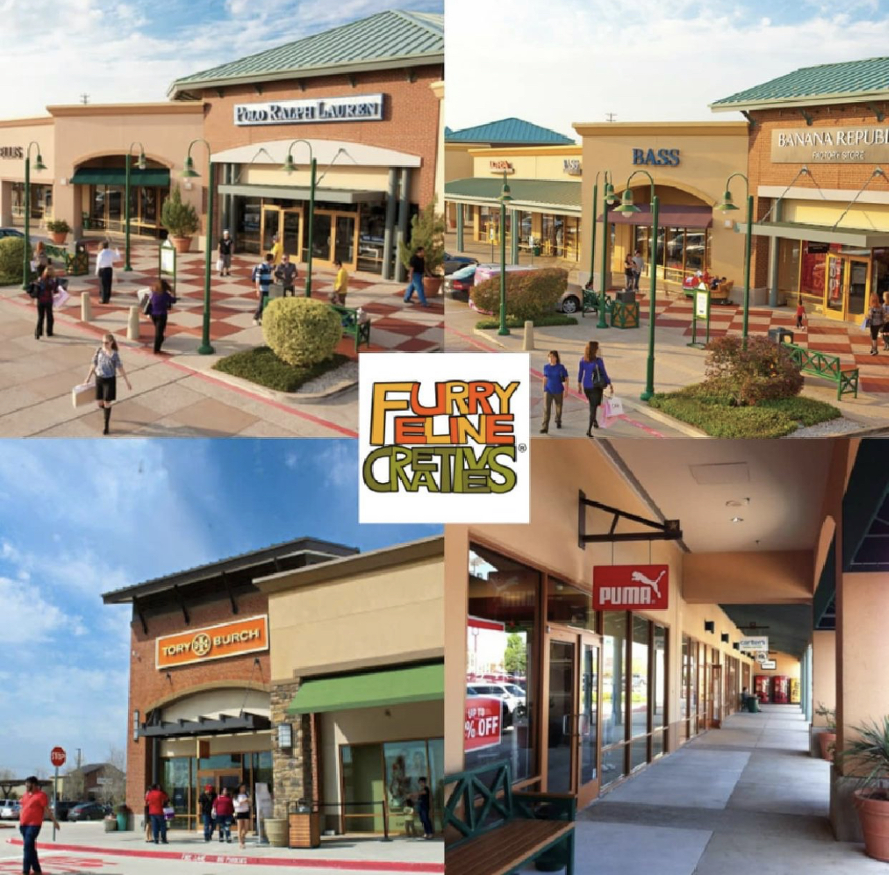

# 12. 购在达拉斯

## [1. 生活超市](https://www.google.com/maps/search/supermarket/@32.9857616,-96.7588862,15z/data=!3m1!4b1!4m8!2m7!3m6!1ssupermarket!2sUniversity+of+Texas+at+Dallas,+800+W+Campbell+Rd,+Richardson,+TX+75080!3s0x864c21ff895e4aa5:0xd9098b32e9aa1331!4m2!1d-96.7500993!2d32.9857619)

|                                    **特点**                                    |                          **UTD附近分店地址**                         |                    **超市名称**                    |
| :--------------------------------------------------------------------------: | :------------------------------------------------------------: | :--------------------------------------------: |
|                **价格最便宜，种类最全，营业至午夜12点，可配钥匙, 有网店。缺点是部分果蔬不太新鲜。**                |                **430 N Coit Rd Richardson, TX**                | <mark style="color:yellow;">**Walmart**</mark> |
|                     **比Walmart小，种类略少。离UTD较近，自营品牌商品价格便宜。**                    |                  **16731 Coit Rd Dallas, TX**                  |                   **Target**                   |
|        **比Target小，精品超市。果蔬非常新鲜，啤酒种类繁多。自营品牌商品价格便宜。有花卉区。营业至凌晨点。离UTD最近。**        |              **1380 W Campbell Rd Richardson, TX**             |                  **Tom Thumb**                 |
|            **比Tomb Thumb小，主打有机食品和保健品，果蔬新鲜。距UTD距离和Tom Thumb基本一样。**            |              **1343 W Campbell Rd Richardson, TX**             |                   **Sprouts**                  |
|       **主打有机食品、调料和红酒。速冻食品和坚果、果脯类种类非常丰富，不乏很多方便美式中餐。有很多别处买不到的零食。离UTD较远。**      | **2400 Preston Rd Ste 200, Preston Towne Crossing, Plano, TX** |                **Trader Joe’s**                |
| **这家中国超市离UTD很近，开车10分钟内就到了。有各种新鲜的菜跟水果。也有很多不同的零食。重点是这个区域很多好吃的餐馆。吃完晚饭去逛超市刚刚好。** |              **2049 Coit Rd #300, Plano TX 75075**             |              **Ztao Marketplace**              |
|                  **中国城里的小型超市，以中式食品、生鲜、调料为主。台湾风味的午餐面当便宜量大。**                  |       **400 N Greenville Ave # 1, Richardson, TX 75081**       |                    **好运来超市**                   |
|                **家居装修用品大全。小到灯泡、螺丝钉，大到整体厨房，应有尽有。有花卉绿植区。可配钥匙。**                |             **2220 N Coit Rd Richardson, TX 75080**            |                 **Home Depot**                 |
|                    **办公用品、扫描复印、电子耗材超市。常年有极低折扣的清仓大甩卖或白送。**                    |               **16817 Coit Rd. Dallas, TX 75248**              |                   **Staples**                  |

#### **配镜**

流程：先找验光师验光，拿到验光单，凭验光单购买，连近视镜也可以在线购买。过程可能比国内久。

* **经济型框架眼镜**

框架眼镜可以在各大超市配，如Walmart和Target。验光（prescription）加镜片$100起，镜架$10起。在商场内也会有专门的眼镜店，镜片镜架选择更多，价格略高。

* #### **文艺型框架眼镜**

推荐Warby Parker这个牌子，设计年轻、质量上乘，每季还会出设计师合作款。既可单独购买镜框、太阳镜，也可以配镜。 常年有一次性选择五种镜框快递到家的火爆试戴活动，先试戴再决定，退回免费。Dallas也有实体店。除了样式好看，价格也非常可爱——prescription+镜框仅售$95，很多美国人都会在WP上选择眼镜。

* **隐形眼镜**

在Walmart，Target，Walgreens这些地方验光后（$105左右，一年有效），凭着验光单据上的视力信息，便可以进行隐形眼镜的网购了。网站会在收到订单后立刻和你所填写的验光师进行联系，确认你的prescription信息后发货**。**

**商场**

* **NorthPark**

地址：8687 N Central Expy, Dallas, TX 75231

营业时间：MONDAY-SATURDAY 10AM - 9PM     SUNDAY 12PM - 6PM

网站：[https://northparkcenter.com/](https://northparkcenter.com)

简介：作为达拉斯顶级的购物天堂，NorthPark拥有超过 200 家零售商，包括奢侈品精品店、引领潮流的品牌服装店、餐厅和电影院。 此外，NorthPark 展出充满博物馆品质的艺术品和非凡的景观，在这里购物是一种与众不同的体验。

推荐指数：★★★★★

* **Galleria**

地址：13350 Dallas Parkway Dallas, Texas 75240

营业时间：MONDAY-SATURDAY 10AM - 8PM     SUNDAY 12PM - 6PM

网站：[https://galleriadallas.com/](https://galleriadallas.com)

简介：作为达拉斯最大的商场之一，Galleria 致力于提供独特的购物、餐饮和娱乐体验。Galleria 面向全体消费群体，除了许多一线品牌以外，小众品牌也一一入驻 Galleria 。此外，如果您对滑冰情有独钟或者想切身感受当地的圣诞节日气氛，那么Galleria将是你的不二之选。

推荐指数：★★★★★

* **Allen Premium Outlets**

地址：820 W Stacy Rd, Allen, TX 75013

营业时间：10:00AM - 9:00PM

网站：[https://www.premiumoutlets.com/outlet/allen](https://www.premiumoutlets.com/outlet/allen)

简介：Allen Premium Outlets 是北达拉斯首屈一指的购物目的地，位于达拉斯北部，交通便利，位于美国 75 号公路，Stacy Rd 37 号出口。该中心最近完成了扩建，为购物者提供了更多的零售商和更多的便利设施。这里拥有 120 多家设计师品牌和名牌直销店，包括 Tory Burch、Kate spade new york、Michael Kors、Coach、Nike 工厂店、Polo Ralph Lauren 工厂店、Under Armour 等等。在这里，您能享受到25-65% 的超凡折扣购物。

推荐指数：★★★★

****

**个人报税&退税**

在商场内购物，带上机票，护照和小票可以在服务中心 (Customer Service) 进行退税。

根据美国税务局规定，外籍学生或学者，无论有收入与否，都需要向税务局提交一份个人资料说明书和联邦税务表。计划在美长期发展的同学，更需要注意，以免后面申请居留时不必要的麻烦。\
