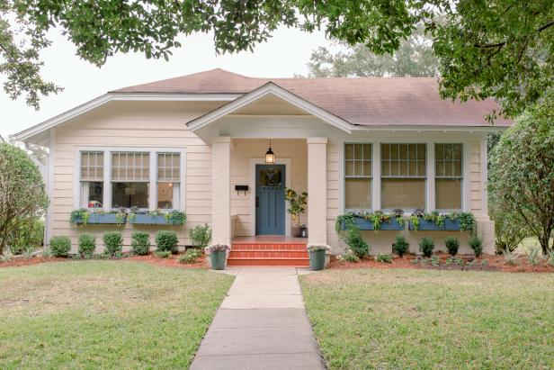

# 7. 住在达拉斯

## 1. **租房**

**谈到租房，就需要先了解一下目前Dallas地区租房的大致情况。在八月份新生入学前后。几乎所有小区都会涨价，特别是校车沿线。对于初来乍到的新伙伴们来说，在没有车又对德州不甚了解的情况下，想落地之后现找质优价廉的房子将非常困难。强烈建议大家在出国之前定好房子！**\
****

### **1.1 公寓（Apartment ）**

**两三层的小公寓，归小区Leasing Office管理，户型类似于中国的普通家庭住房。房租之外需要自付水电网，不同小区可能会有排污费（sewage）, 垃圾费（trash）等。Apartment一般都会自带冰箱，烤箱，微波炉、洗碗机，有的还会带洗衣机和烘干机。房型xByB则是表示x个Bedroom，y个Bathroom，每个小区的房型是不同的，需要大家在小区官网上查看。**

.jpg>)

**流程基本为填写申请—提供所需材料（护照、I20、录取通知扫描件等）—支付申请费（信用卡，现金，支票最好都备好）—收到确认信。签订正式的Lease。请注意签定时和Leasing Office沟通好入住细则（如停车、宠物、垃圾处理等细节）以免日后麻烦。**\
****

**建议新生在出国之前查看校内外各小区官网，大概了解不同小区房型与价位，如能提前确定，请及时与其Leasing Office通过电邮或电话联系订房。正式Lease需本人抵美后亲自去Leasing Office签订，或对于接受电子签名的Leasing Office来说，也可以在国内通过网上就签下。**

**学校周边车程5分钟内的公寓：**

**Northside：**

****[**https://www.liveatnorthside.com/inspired-living/**](https://www.liveatnorthside.com/inspired-living/)****

**Estates of Richardson：**

****[**https://www.rentanapt.com/apartments/tx/richardson/estates-of-richardson/**](https://www.rentanapt.com/apartments/tx/richardson/estates-of-richardson/)****

**Cortland Canyon Creek：**

****[**https://cortland.com/**](https://cortland.com)****

**The Pradera：**

****[**https://www.thepradera.com/**](https://www.thepradera.com)****

**Marquis at Waterview：**

****[**https://www.cwsapartments.com/apartments/tx/richardson/marquis-at-waterview/**](https://www.cwsapartments.com/apartments/tx/richardson/marquis-at-waterview/)****

**Creekside Townhomes：**

****[**https://creekside.rentals/**](https://creekside.rentals)****

### **1.2 独立屋（House）**

**即国内常说的高大上小别墅。其实就是独门独院的房子，一到两层，房型不同，大部分有车库。室内设施取决于房主，一般会自带冰箱、烤箱和洗碗机。室外有草坪的House还要定期修剪（不修剪会得到警告，多次警告后即罚单），可以自行修剪（割草机价格从$30-$300+不等）或者雇人打理（费用根据草坪面积不同而不同）。在租House之前，需要跟Owner或者Agent商量水电及煤气、割草的相关费用问题。**

## **2. 房屋保险**

**大部分小区要求住户提供Proof of Renter Insurance。此租房保险用于保障房主在房屋被窃、失火等意外发生后的利益。保险公司可以自己选择，在签订Lease的时候，Office也会做出相应推荐可供选择。保险费用可以按月/季度/年支付。**\
****

* **公用设施**

**小区公用设施包括游泳池、公共洗衣房、健身房、打印室等。**\
****

* **停车位**

**大部分小区需购买停车位，费用由每月$20到$100不等，露天免费，其次顶棚，最贵的是garage，费用由每月20-150。德州每年都会下冰雹，建议大家停在遮挡物下。详情请询各Leasing Office。通常小区带顶棚的停车位是需要每月单独付费的，因此如果停在别人已经购买的车位上，很可能会被拖车公司拖走。所以小区停车也不要乱停，确认什么样地方可以停，什么样地方不可以停，以免不必要麻烦。**\
****

* **维护（Maintenance）**

**小区物业会定时（如每年两次）提供公寓设施维修服务。家中设备不正常运行（如门窗损坏，门锁更坏，空调故障等）可以随时联系Leasing Office寻求解决。正常的Maintenance都是免费的。定期保修以及维护好家里的设备有助于在Lease到期时少扣很多押金。**\
****

* **除虫（Pest Control）**

**入住前物业会对房屋进行彻底除虫。建议同学们在住房期间讲卫生，勤倒垃圾，杜绝蟑螂蚂蚁出现的可能性。德州环境干燥，但蟑螂时有出没。出现无法解决的虫灾请立即联系Leasing Office预约Pest Control。**\
****

## **3. 房屋基本配置及设施**

**水**

**24小时冷热水供应，冷水符合饮用水标准可以直接饮用，水龙头里的热水不可饮用，据说水中的铅遇热较容易分解。冷水可以选择购买滤水壶（Water Filter），想喝热水请自行购买烧水壶，各大超市均有销售。中美水质有差异，最初身体可能会有不适。饮用水超市里瓶装矿泉水也很便宜。**\
****

**电**

**常见的电力公司是德州电力公司：TXU Energy。在签完房屋Lease时，Leasing Office会提供电力公司的信息，部分Office可以帮忙开通电力，但大部分需要自己打电话开通。目前大部分电力公司也支持在网上提前开通。开通时请准备好住址、电话、银行卡信息等。此后每月会收到收费邮件，可以在官网上支付账单、查看电力使用情况等。如果开通遇到问题请打电话给电力公司。**\
****

**网**

**AT\&T（美国电话电报公司）是美国第一大电信运营商，也提供网络服务。网络名称叫做U-verse high speed internet， 不同速度的plan以及绑定TV或phone的package价格都列在官网上。 办理完成后，部分区域可以提供上门安装，部分区域会收到modem，自行安装即可。**

**申请网址：**[**http://www.att.com**](https://www.att.com)****

**Time Warner Cable是另一家网络公司，除了网络服务，也提供电视和手机服务。 同学们可以去店里签署合同，也可以在官网上申请。无论是哪一种，都请注意网络安装方式（所需equipment、安装方式等） 。**

**申请网址：**[**http://www.timewarnercable.com**](https://business.spectrum.com)****\
****

## **4. 房屋自带设施**

* **空调（我们常说的AC在美国通常仅指冷气，吹热风叫heating system）：**

**空调是达拉斯最基础的配置。夏天的德州相信大家很快就会见识到。公共场所的空调开的很足，去上课或自习时建议怕冷的同学自带一件外套。**

* **烟雾感应器（Smoke Detector）：**

**安装在房顶上的一个传感器，用于监测烟雾的浓度。美国每间房子里都有至少两个。中国留学生特别需要注意的是炒菜时避免烧焦等会产生浓雾的情况发生。一旦引发烟雾警报器，马上处理油烟，开窗透气。如果还是没用，可以马上取下警报器电池。否则等消防车赶到，警告或罚单也就随之而来了。同时，聚众吸烟也可能会引发警报器。**

* &#x20;**厨房：**

**冰箱，烤箱，微波炉、洗碗机、下水道搅碎机等是标准配置。**\
****

## **5. 家具**

**全新家具可以从IKEA, Walmart等处购买。Dallas地区的IKEA地址是7171 IKEA Drive, Frisco, TX 75034, 距离学校较远，买大件家具需要送货上门。**

**具体送货要求和费用请参考：**[**http://www.ikea.com/us/en/store/frisco/service**](https://www.ikea.com/us/en/stores/frisco/)****

**需要特别强调的是床！**

| **Size**        | **宽\*长**                           | **适宜人数** |
| --------------- | ---------------------------------- | -------- |
| **Twin**        | **39 in × 75 in （99 cm × 191 cm）** | **单人**   |
| **Double/Full** | **54 in × 75 in（137 cm × 191 cm）** | **成人单人** |
| **Queen**       | **60 in × 80 in（152 cm × 203 cm）** | **双人**   |

**注意，身高180cm以上的同学建议考虑queen或king及以上。**&#x20;

**床的构造（分开卖）：**

**Ø  Mattress：床垫。**

**Ø  Box：床垫下面的硬盒。**

**Ø  Frame：用于把Mattress和Box支起来。**

## **6. 校内住宿**

**校内住宿分为University Common，University Village 和 Canyon Creek。UC仅供本科大一新生入住。住校大一新生也只能选择UC。**

**University Common（UC）**

**价格：$3900/学期**

**UC拥有5栋宿舍楼：Residence Hall Northwest，Residence Hall North， Residence Hall West，Residence Southwest 和 ResidenceSouth。每栋楼的分布大同小异。**\
****

**（户型图）**

**主要针对本科新生，所有的本科新生如果选择第一年在校内住宿，必须住在UC。UC 是一个半独立的宿舍。3个独立的卧室，3个洗手池，1个客厅，1个厕所，1个公用浴室。房间内有TwinXL的床架和床垫，一个三层抽屉的柜子，一张书桌和一张椅子，和衣架。但房间隔音较差。UC一楼大厅含有娱乐设施，如桌上足球，台球，乒乓球。除此之外，洗衣机和烘干机也位于一楼。**

**另外，选择住在UC还必须购买学校的餐券。餐券价格$1800起。**\
****\
****\
****

**University Village (UV)**

**UV有多达七种房型可选。**

&#x20;   **（UV价格表）**

**UV相比于UC空间更宽敞,仅供大二及以上选择。具体户型图可以在UTD官网查阅。**\
****

**Canyon Creek Heights**

&#x20;   **（Canyon Creek Heights价格表）**

**Canyon Creek Heights是学校新建的公寓楼，拥有四种房型。相比UV和UC，Canyon Creek Heights的外观更崭新。具体户型图可以在UTD官网查阅。**

**校内房源紧张，人多房少，建议提早申请。**

**更多详情请浏览：**[**https://housing.utdallas.edu/**](https://housing.utdallas.edu)****

****

## **7. 家具及家电**

**在美住房大部分公寓都是不带家具的。新家具可在 IKEA、Mattress Firm、Walmart、Target、Rooms to Go等卖场购买。**

**通常提供付费运送服务，IKEA费用达$49可免费送货。二手家具可关注微信群或FACSS论坛。**

**若一般车子载不下，可找数人合租 U-Haul ：**[**https://www.uhaul.com/**](https://www.uhaul.com)****
