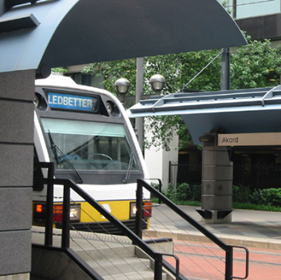

# 8. 行在达拉斯

## 1. 出行方式

### **1.1 883路UTD校车**

**UTD的校车883：学校的校车主要分东西两线，东线30min一趟，西线20min一趟。校车运营时间为周一到周六:7am-11pm， 周日:10am-6pm。周五周日西线还会加开Extension路线目的地为沃尔玛。**

**大家可以下载 “transit” APP来查看校车的实时位置以及校车到达附近站点的时间，提醒大家一定要在校车到达站点前在指定位置等候，最好预留两分钟时间(有时候transit会差一两分钟)，以免错过校车。刚开学可能部分校车比较拥挤，学校也会加派校车两辆同行，大家不用担心。**

**关于校车的更多信息可以浏览：**[**https://services.utdallas.edu/transit/cruiser/**](https://services.utdallas.edu/transit/cruiser/)****\
****

### **1.2 Dart Pass**

**UT Dallas的同学可以免费乘坐Dallas的公共快速交通系统（Dallas Area Rapid Transit），包括公交车和去Dallas downtown的路上轻轨等交通工具，可以带你去Dallas和周围的12个城市。**

**申请流程：**

****[**https://services.utdallas.edu/transit/dart/**](https://services.utdallas.edu/transit/dart/)****

**第一个连接点进去输入你的NetID和密码，然后根据指示完成申请即可。申请成功后校方会邮件通知新生领取卡贴的地点，领取卡贴后将卡贴粘贴至Comet Card上视为有效乘车凭证。**

### **1.3 Texas驾照申请**

| **网考(18-24岁)** | **DPS官网上推荐了很多网站提供交规学习和网考。需要注意的是，18岁以下的驾驶者只能在DPS现场考试；18-24岁的可以选择网考；25岁及以上不需要考交规。**                                                                 |
| -------------- | ------------------------------------------------------------------------------------------------------------------------------------------------- |
| **申请Permit**   | **在德州居住满30天后即可申请Permit（Learner’s license）。材料包括：网考通过证明、护照、I20、i94和三种带驾驶者地址的有效文件（包括但不限于bank statement、学校成绩单、电力账单、租房合同、政府公文，等等）。Permit持有者不可独自驾驶车辆。** |
| **预约路考**       | **可以在DPS官网预约（最早日期为一个月之后的周一至五，有时排至两三个月后），或到DPS现场约（成功可能性较小）。**                                                                                      |
| **路考合格后获得驾照**  | **携带考试材料，提前一小时到DPS 办公楼内check-in。check-in后不是严格按照预约时间进行考试，而是在指定处排队，先到先考。考点不提供考试车，须要用自己的车。车辆须有保险，并保证车灯、喇叭等正常工作。路考通过后当天即可发纸打驾照，成为合法司机。**              |

**网考网址：**[**https://www.comedydrivingcompany.com**](https://www.comedydrivingcompany.com) **（并不唯一）**

**24岁以下需网上学习：**[**https://impacttexasdrivers.dps.texas.gov/**](https://impacttexasdrivers.dps.texas.gov)****

**申请Permit&驾照网址:**  [**https://public.txdpsscheduler.com/**](https://public.txdpsscheduler.com)****

**预约路考网址：**[**https://www.allstardrivingschools.net/**](https://www.allstardrivingschools.net)**（并不唯一）**

## **2. 购车指南**

* **购车方式**

**既然这么多同学最后都选择了自己驾车出行，所以难免的要牵扯到买车的问题。根据以往的经验，UTD读研究生的同学大部分还是买的二手旧车，一方面美国的二手车市场比较规范，另外一方面对于在美国待一年或两年的同学，二手车也更保值。买二手车一般有三种方式：owner，dealer和auction。owner就是从私人手里买车，dealer就是从大的汽车经销商的手里买，auction就是拍卖拍到二手车。**

**如果在国内就有车并且有一定驾龄比较了解车辆的同学，可以试试从owner处买，也就是从学长学姐手里买二手车。这个可以通过人脉或者群邮等方式获取信息，一定要亲自查看车况再做决定，也可以根据车况来跟车主砍价。**

**在dealer处买车就省心的多，但是弊端也显而易见就是同车况价格可能比owner贵一点。如果选择dealer请选择比较大或者口碑比较好的dealer，可以去一些网站可以查看此类信息。dealer一般在网上的报价会略高，在店里看车试车完毕以后可以根据车的情况酌情砍价，往年经常有在网站价格上砍下一两千块并且车况没有问题的情形发生。**

**在auction一般的消费者是不能独自去的，需要有相关执照的人带领进去看车，往年有同学在dealer或其他渠道找到专门带人拍车然后收取佣金的agent，然后拍到价格还不错的车子。但是auction的车子没法开出去试，尽管价格比dealer处的便宜，但是车况不能完全保证。**

**不管从什么渠道购买，看车之前请先查vin report，并且做pre-purchase inspection，请确定车况然后确定title，title是一辆车的唯一凭证，请妥善保管不要放在车上。title的类型有很多种，一般同学买到的都是clean title，如遇见rebuilt或salvage title请尽量不要购买，一来你不知道车子到底伤得有多严重恐日后出现问题影响行车安全，二来将来卖车买家可能会有所考虑。**\
****

* **车型选择**&#x20;

**在美国的街上，一般说来，日本车占有很大比重，而且老生还是买日本车的比较多，日本车相对来说也比较保值。坊间有很多说法，比如“德国车结实日本车薄”，“日本车保养得好德国车小毛病多，美国车过了十万迈就快报废了”。但这些说法可能带有偏见，车的安全情况主要看司机的驾驶，车也要看保养，请根据每一辆车的车况去判断。根据老生的购买情况，还是购买四大神车比较多（雅阁Accord，思域Civic，凯美瑞Camry和卡罗拉Corolla），其他日本品牌比如马自达和日产也是不少的。当然还有很多男同学会体验一下美系大排量跑车如科迈罗和野马。如果真的不太懂车又怕修，又想将来卖车的时候亏损少一点，可以选择在大dealer处购买四大神车，预算够的话可以购买年份稍近的，这样还有warranty，如果需要修理或日常保养可以不用花钱在dealer处做（warranty的时间长短和里程要求请咨询dealer，不同公司不太一样）。如果对车型有偏好的话，请根据需求购买，前提是一定要注意安全。**

* **Title changing**

&#x20;**购车之后，一件很重要的事情就是去tax office办理title的ownership change，只有办理结束，购车流程才算彻底结束。办理时，需要携带title form和驾照以及银行卡等，工作人员会询问是否更换车牌，可以选择继续使用原车牌，也可以更换车牌，随机车牌免费，定制车牌需收费。更换结束后，tax office会在大概一两周时间内寄到家地址。**&#x20;

* **汽车州检**
* **Liability（法律规定基本额度）**

&#x20;**德州政府强制每辆车都必需保 liability 才可上路。当你为肇事责任方 (at fault) 时，保险公司为你支付对方的医疗费用及财产损失。细分成 Bodily injury liability 与 Property damage liability 两部份，前者赔偿受害者医疗费用，后者赔偿其财产损失。**

* &#x20;**Uninsured Motorist**

&#x20;**当对方为肇事责任方，而对方无保险、或肇事逃逸 (Hit & Run)、或额度不足时，保险公司将支付你的医疗费用及财产损失。**

* &#x20;**Personal Injury Protection (PIP)**

&#x20;**当己方肇事，自己或乘客需要去医院治疗时，保险公司支付医疗费用。**

* &#x20;**Comprehensive**

&#x20;**车祸以外的其他原因（窃盗、天灾）造成车子受损，保险公司将赔偿超过 Deductible（自付额）的部分。自付额愈低，保费愈高。**

* &#x20;  **Collision**

&#x20;**当你为肇事责任方，任何碰撞导致你的车损坏时，保险公司将赔偿超过 Deductible 以外的部分。 （想撞树换新车就保这个）**

* &#x20;  **Rental Reimbursement**

&#x20;**当你的车因为事故无法使用，需要租车时，保险公司将赔偿保额内的租车费用。**

* &#x20;   **Emergency Roadside Assistance**

&#x20;**当你呼叫道路救援时，保险公司将支付保额内的费用。**

**❖ 我该保哪些？**

**除了德州法律规定的 Liability 额度外，如果开车技巧熟练，有信心不会成为肇事责任方，可以只加保 Uninsured Motorist，避免对方肇事逃逸。若担心自己去撞别人或打滑撞树，可以加保 Collision。若担心天灾或车子被窃，可加保Comprehensive。**

**❖ 保费如何计算？**

**★ 注：以下只是参考，没有一定，主要看你的 credit 代码所落在的保险层级；建议一开**

**始就找可以累积 credit record 的保险公司。**

**1. 驾龄：美国境内驾驶时间越长，保费越低，安全驾驶一年后保费将明显变低。**

**2. 年龄：男生 25 岁、女生 21 岁以上，保费相对较低。**

**3. 性别：同状况下，女生较男生便宜。统计结果显示女生发生事故的机率较低。**

**4. 车型：车子越旧、价值越低，保费越便宜。不同车型，甚至颜色，保费都不同。**

**5. 驾驶纪录：罚单、事故纪录，会使保费提高。**

**6. 索赔纪录：过去向保险公司索赔的纪录将使保费提高。**

**7. 学生成绩：成绩维持一定水准部分保险公司可提供保费折扣。**

**5.5 Repair and Maintenance**

**买车之后每 3,000-5,000 英哩或四到六个月须做一次 Oil Change + Filter。换机油各地**

**方基本上价差不大，若想顺便为车子做检查，可回原厂或华人修车厂，比较不会被坑。**

* **汽车保险(冰雹险)**

**德州的三月到六月都有可能会出现冰雹天气，小冰雹会对车的外观造成影响，大冰雹会造成汽车的损坏，所以购买冰雹险是非常重要的，建议同学们在冰雹季开始之前提前跟自己的保险公司打电话，为自己的爱车加一份冰雹险，或者在冰雹预报后及时将爱车停在有遮掩物的区域，或者购买防冰雹车衣，避免财产损失。**

* **汽车清洗及保养**

**德州有很多汽车清洗点，都可以免费自助吸尘。如果清洗外观，有一套自助的机器流程，非常方便简单，如果清洗内饰，涉及到人工成功，价格会比较高。**

**关于汽车的保养，虽然大部分购买的是二手车，之后毕业会继续转卖出去，但还是强烈建议根据自己汽车的性能，按时进行车的保养维修，避免不及时修理在路途中产生麻烦，也为自己的健康保驾护航。**\
****

* **Tollway tag**

**申请网址：**[**https://www.ntta.org/Pages/default.aspx**](https://www.ntta.org/Pages/default.aspx)****

**德州的高速分为两种，一种是免费高速highway，一种是收费高速tollway。收费高速tollway会通过摄像头记录你的车牌号从而产生费用，建议同学们如果需要走收费高速的话，提前在网上购买好tolltag，预存一部分钱，每次产生费用都从账户中扣减。如果没有办理tolltag的话，也可以走收费高速，但是要记得去当地的office及时缴纳费用。**

* **校园停车牌**

**申请网址：**[**www.utdallas.edu/services/transit/park**](https://services.utdallas.edu/transit/park/)****

**校内停车需购买 Parking Permit，可在线上购买（permit 会用邮寄的方式，收到之前，可印下购买收据当作临时车证 30 天），或到 Parking Office（位于 PS3 1.200）现场排队购买。普通学生可使用的停车证等级由低至高分为绿、金、夜间橘、橘四种（可于网站上详阅）。可查看 Parking Map 确认各色车位分布情形，绿色、金色为大多数学长姐的选择；住校生通常是买红色，但离上课处较远，是否需购买两种颜色请自行评估。违规停车在高于自己等级车位者会被锁轮胎并罚款。不同的停车证介绍：**

|                                                                                                                                                                                                                                       | **Cost**                                | **可停区域**            | **距离教室**        |
| ------------------------------------------------------------------------------------------------------------------------------------------------------------------------------------------------------------------------------------- | --------------------------------------- | ------------------- | --------------- |
| <mark style="color:green;">**Green Permit**</mark>                                                                                                                                                                                    | **每年价格可能会变动，请自行上网查阅确认。**                | **Green**           | **15 - 25 min** |
| <mark style="color:yellow;">**Gold Permit**</mark>                                                                                                                                                                                    | **Green, Gold**                         | **10 - 15 min**     |                 |
| <mark style="color:orange;">**Evening Orange Permit**</mark>                                                                                                                                                                          | **Green, Gold, Orange after 5 p.m.**    | **5 - 10 min**      |                 |
| <mark style="color:orange;">**Orange Permit**</mark>                                                                                                                                                                                  | **Green, Gold, Orange**                 | **< 5 min**         |                 |
| 
<mark style="color:red;"><strong>University Village &#x26;Canyon</strong></mark>

<mark style="color:red;"><strong>Creek Heights Apartments</strong></mark>

<mark style="color:red;"><strong>Permit</strong></mark>
 | **学校宿舍 + Green**                        | **15 - 25 min**     |                 |
| **Pay-By-Space**                                                                                                                                                                                                                      | **$2 first hour +$1 / additional hour** | **metered parking** | **< 5 min**     |

**停车证通常以一年期限为主，Fall 购买的话是从当年 9 月至隔年 8 月都有效，年中购买价格会有所调整。学校停车地图(有各颜色可停区域的标示)： https://goo.gl/R5LrzB**

****

## **3. 行车安全(包括pull over时做法)**

**车辆开在路上，其实是一件很危险的事情。尤其很多同学来到这边才接触车辆，或者刚刚在国内拿到驾照没有长时间的上路驾驶经验，加上美国交规和国内的不同。对于练车,尽量在来美国前就多练习多上路，对车辆的感觉有一定的把握。来了做到不怕上路，多熟悉美国驾驶习惯因为美国大多数都是高速车速较快。请一定注意“车轮一动，安全第一”。**

.jpg>)

**(1) 当你违规时，警察会跟在你的车子后面闪灯，此时需慢慢的切换车道至安全处靠边停车；若在主干道上需开进 Plaza 内。停车后将车窗降下，引擎熄火，双手扶着方向盘，等待警察下车问话，不要有任何未预期的动作。一般警察需要你出示驾照和保险单,可以提前先拿出来，或者在警察的指引下慢慢拿出。如果驾照在口袋里需要伸手拿出，请提前告知警察你的动作，请勿有过激的动作出现。双手时刻保持在警察的视线范围内。**

**(2)  被开罚单会留下不好的驾驶纪录，可多缴钱选择 Probation，三个月内安全驾驶及可以消除纪录。或是线上观看 Driver Safety Course 消除纪录，一年限一次。推荐** [**https://www.comedydriving.com/**](https://www.comedydriving.com) **。上完课后，需将 Certificate 与申请 Driving Record 一同寄回法院，无 SSN 者无法线上申请 Driving Record，寄信申请需 21 个工作天才会寄到。要注意法院要求的截止日期。**
